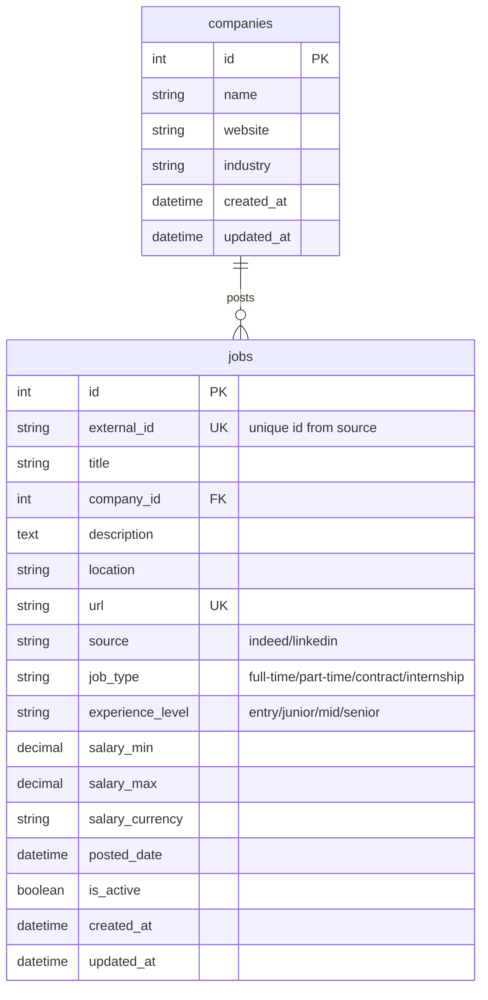

# Database Schema Design (Simplified)

## Overview
A simplified database schema focused on efficiently storing and filtering job listings, particularly for Marketing Junior positions.

## Entity Relationship Diagram



## Tables Definition

### 1. jobs
Primary table storing all job listings with focus on Marketing Junior positions.

| Column | Type | Constraints | Description |
|--------|------|------------|-------------|
| id | INT | PK, AUTO_INCREMENT | Primary key |
| external_id | VARCHAR(255) | UNIQUE, NOT NULL | Original ID from source |
| title | VARCHAR(500) | NOT NULL | Job title |
| company_id | INT | FK | Reference to companies table |
| description | TEXT | NOT NULL | Full job description |
| location | VARCHAR(255) | | Job location |
| url | VARCHAR(767) | UNIQUE, NOT NULL | Original job URL |
| source | ENUM('indeed', 'linkedin') | NOT NULL | Data source |
| job_type | ENUM('full-time', 'part-time', 'contract', 'internship') | | Employment type |
| experience_level | ENUM('entry', 'junior', 'mid', 'senior') | | Required experience |
| salary_min | DECIMAL(10,2) | | Minimum salary |
| salary_max | DECIMAL(10,2) | | Maximum salary |
| salary_currency | VARCHAR(3) | DEFAULT 'VND' | Currency code |
| posted_date | DATETIME | | When job was posted |
| is_active | BOOLEAN | DEFAULT TRUE | If job is still available |
| created_at | DATETIME | DEFAULT CURRENT_TIMESTAMP | |
| updated_at | DATETIME | ON UPDATE CURRENT_TIMESTAMP | |

### 2. companies
Store company information.

| Column | Type | Constraints | Description |
|--------|------|------------|-------------|
| id | INT | PK, AUTO_INCREMENT | Primary key |
| name | VARCHAR(255) | NOT NULL | Company name |
| website | VARCHAR(500) | | Company website |
| industry | VARCHAR(255) | | Industry sector (e.g., Marketing, Advertising) |
| created_at | DATETIME | DEFAULT CURRENT_TIMESTAMP | |
| updated_at | DATETIME | ON UPDATE CURRENT_TIMESTAMP | |

## Indexes

```sql
-- Performance indexes for filtering Marketing Junior jobs
CREATE INDEX idx_jobs_experience ON jobs(experience_level);
CREATE INDEX idx_jobs_title ON jobs(title);
CREATE INDEX idx_jobs_posted_date ON jobs(posted_date DESC);
CREATE INDEX idx_jobs_company ON jobs(company_id);
CREATE INDEX idx_jobs_active ON jobs(is_active);
CREATE INDEX idx_jobs_location ON jobs(location);

-- Full-text search for Marketing keywords
CREATE FULLTEXT INDEX idx_jobs_search ON jobs(title, description);

-- Company filtering
CREATE INDEX idx_companies_name ON companies(name);
CREATE INDEX idx_companies_industry ON companies(industry);
```

## Sample Queries

### 1. Get Marketing Junior jobs
```sql
SELECT j.*, c.name as company_name, c.industry
FROM jobs j
JOIN companies c ON j.company_id = c.id
WHERE j.is_active = TRUE
  AND j.experience_level IN ('entry', 'junior')
  AND (j.title LIKE '%Marketing%' OR j.description LIKE '%Marketing%')
ORDER BY j.posted_date DESC
LIMIT 20 OFFSET 0;
```

### 2. Filter Marketing Junior jobs by location and salary
```sql
SELECT j.*, c.name as company_name
FROM jobs j
JOIN companies c ON j.company_id = c.id
WHERE j.is_active = TRUE
  AND j.experience_level = 'junior'
  AND (j.title LIKE '%Marketing%' OR j.description LIKE '%Marketing%')
  AND j.location LIKE '%Ho Chi Minh%'
  AND j.salary_min >= 8000000
ORDER BY j.salary_max DESC;
```

### 3. Get companies hiring for Marketing positions
```sql
SELECT 
  c.name,
  c.industry,
  COUNT(j.id) as job_count,
  AVG(j.salary_min) as avg_min_salary
FROM companies c
JOIN jobs j ON c.id = j.company_id
WHERE j.is_active = TRUE
  AND (j.title LIKE '%Marketing%' OR c.industry LIKE '%Marketing%')
  AND j.experience_level IN ('entry', 'junior')
GROUP BY c.id
ORDER BY job_count DESC;
```

## Database Creation Script

```sql
-- Create database
CREATE DATABASE IF NOT EXISTS job_scraper_db CHARACTER SET utf8mb4 COLLATE utf8mb4_unicode_ci;
USE job_scraper_db;

-- Create companies table
CREATE TABLE companies (
    id INT AUTO_INCREMENT PRIMARY KEY,
    name VARCHAR(255) NOT NULL,
    website VARCHAR(500),
    industry VARCHAR(255),
    created_at DATETIME DEFAULT CURRENT_TIMESTAMP,
    updated_at DATETIME DEFAULT CURRENT_TIMESTAMP ON UPDATE CURRENT_TIMESTAMP
);

-- Create jobs table
CREATE TABLE jobs (
    id INT AUTO_INCREMENT PRIMARY KEY,
    external_id VARCHAR(255) UNIQUE NOT NULL,
    title VARCHAR(500) NOT NULL,
    company_id INT,
    description TEXT NOT NULL,
    location VARCHAR(255),
    url VARCHAR(1000) UNIQUE NOT NULL,
    source ENUM('indeed', 'linkedin') NOT NULL,
    job_type ENUM('full-time', 'part-time', 'contract', 'internship'),
    experience_level ENUM('entry', 'junior', 'mid', 'senior'),
    salary_min DECIMAL(10,2),
    salary_max DECIMAL(10,2),
    salary_currency VARCHAR(3) DEFAULT 'VND',
    posted_date DATETIME,
    is_active BOOLEAN DEFAULT TRUE,
    created_at DATETIME DEFAULT CURRENT_TIMESTAMP,
    updated_at DATETIME DEFAULT CURRENT_TIMESTAMP ON UPDATE CURRENT_TIMESTAMP,
    FOREIGN KEY (company_id) REFERENCES companies(id)
);
```

## Data Retention Policy

- Active jobs: Keep indefinitely
- Inactive jobs: Archive after 90 days
- Focus on maintaining fresh Marketing Junior positions